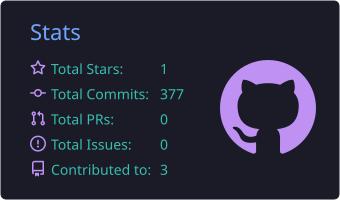
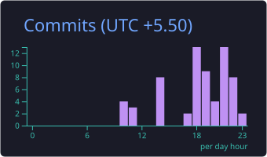
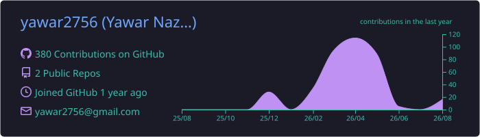

# 👨‍💻 Yawar Nazir Sheikh

### 2nd Year B.Tech CSE @ NMAM Institute of Technology, Nitte

**Full-Stack Developer · IoT Builder · Backend Enthusiast**

  

---

## 👨‍💻 About Me

I'm a **2nd-year B.Tech Computer Science & Engineering student at NMAM Institute of Technology, Nitte**, focused on building practical software systems and real-world applications.

My interests currently include:

- Backend Engineering
- Full-Stack Development
- IoT & Embedded Systems
- REST API Development
- PostgreSQL & Database Systems
- Cloud Deployment
- AI & System Design

I enjoy taking an idea from:

**Concept → Architecture → Implementation → Deployment**

> Build real things. Understand how they work. Improve them continuously.

---

## 🛠️ Tech Stack

---

## 🚀 Featured Projects

<table>
<tr>

<td width="50%" valign="top">

<h3>🌦️ GPCA Smart Weather Station</h3>

A real-time IoT weather monitoring system built using environmental sensors and an ESP8266-based architecture.

<b>Architecture</b>

Environmental Sensors → ESP8266 → REST API → Flask → PostgreSQL → Dashboard

  

<b>Stack</b>

<code>ESP8266</code>
<code>Python</code>
<code>Flask</code>
<code>PostgreSQL</code>
<code>JavaScript</code>
<code>Chart.js</code>

  

<a href="https://github.com/yawar2756/iot-weather-station">
View Repository →
</a>

</td>

<td width="50%" valign="top">

<h3>🏥 Clinic Management System</h3>

A full-stack application designed to manage clinic workflows, appointments and application data.

<b>Stack</b>

<code>Node.js</code>
<code>React</code>
<code>Database</code>
<code>REST API</code>

  

<b>Focus</b>

Backend Architecture · API Design · Application Workflows

  

<b>Status:</b> Development

</td>

</tr>
</table>

---

## 📊 GitHub Analytics

 

---

## 📈 Contribution Overview

---

## 📈 Contribution Activity

---

## 🏆 GitHub Achievements

---

## 🧊 Contribution 3D

---

## 🎯 2026 Focus

- ✅ Strengthen CSE fundamentals
- ✅ Build real-world projects
- ✅ Improve backend development
- ✅ Work with IoT systems
- ✅ Practice API & database design
- ⬜ Build AI-powered applications
- ⬜ Deepen cloud architecture
- ⬜ Improve system design
- ⬜ Deploy production-grade applications
- ⬜ Contribute to open source

---

## 📚 Currently Exploring

**🤖 AI** &nbsp; · &nbsp;
**☁️ Cloud** &nbsp; · &nbsp;
**🧠 System Design** &nbsp; · &nbsp;
**⚙️ Backend Architecture** &nbsp; · &nbsp;
**🔌 IoT**

---

## ⚡ Development Philosophy

### Learn → Build → Break → Debug → Improve → Ship

---

## 🌐 Connect

  

**Build · Learn · Ship**

