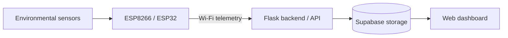

  
  
  
  

---

## Who I Am

I'm a Computer Science and Engineering student at **NMAM Institute of Technology, Nitte**. I build projects that connect software to real hardware, from microcontroller sensors to backend APIs and web dashboards.

| | |
|---|---|
| **Degree** | B.Tech in Computer Science & Engineering, NMAMIT Nitte (2026 – 2029) |
| **Previous** | Diploma in Computer Engineering, Government Polytechnic College Anantnag (2023 – 2026) |
| **Based in** | Anantnag, Jammu & Kashmir |
| **Currently studying** | Data structures, working through linked lists in C |
| **Status** | Open to opportunities |

---

## Featured Project: GPCA Smart Weather Station

An IoT weather-monitoring system built for **Government Polytechnic College Anantnag**, co-developed with **Muhammad Yaseen**.

**Data flow**

```mermaid
flowchart LR
    A[Environmental sensors] --> B[ESP8266 / ESP32]
    B -->|Wi-Fi telemetry| C[Flask backend / API]
    C --> D[(Supabase storage)]
    D --> E[Web dashboard]
```

**What it does**

- Collects readings from sensors on ESP8266/ESP32 boards
- Sends them over Wi-Fi to a Flask backend API
- Stores data in Supabase for persistence and history
- Displays readings and trends on a web dashboard, deployed on Render for remote access

<b>Tech used in this project</b>

 

> The dashboard is a live demo. Readings depend on the connected hardware and deployment status. It is not a certified meteorological instrument.

---

## Other Projects

- **Clinic Management System**

---

## Tech Stack

| Area | Technologies |
|---|---|
| **Programming** | Python, C, Java |
| **Web & backend** | Flask, REST APIs, HTML, CSS, JavaScript |
| **Data** | SQL, PostgreSQL, Supabase |
| **IoT & embedded** | ESP8266, ESP32, sensors, Arduino IDE |
| **Tools** | Git, GitHub, Linux, VS Code |
| **Computer science** | Data structures & algorithms, OOP, DBMS fundamentals |

---

## GitHub Stats

These cards come from third-party services and may be unavailable at times. Language stats reflect repository contents, not skill level.

---

## Let's Connect

